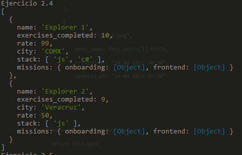

# Weekly Mission 2

## Ejercicios resueltos

### Ejercicio 01 Objectos simples

### Ejercicio 02 Listar objectos

Imprime el nombre (propiedad name) de cada explorer en la lista, usa FOR EACH

Imprime el stack de cada explorer, usa FOR EACH

Crea una nueva lista con las listas de stacks de cada explorer, usa MAP

Obtén la lista de explorers que tengan en su stack "js", usa FILTER (para validar un elemento en un lista se usa el método includes)

Busca el primer explorer que sea de la CDMX, usa FIND

Obtén la suma de todos los exercises_completed, usa REDUCE

Obtén la validación si al menos uno de los explorers tiene la propiedad exercisesFinished en frontend como true, usa SOME

Obtén la validación si todos los explorers tienen la propiedad isFinished del onboarding como true. Usa EVERY.

### Ejercicio 03 Programación orientada a objetos (Testar objectos)

