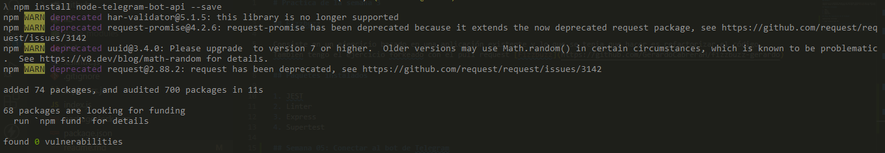
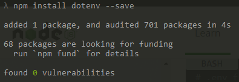
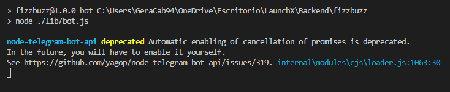
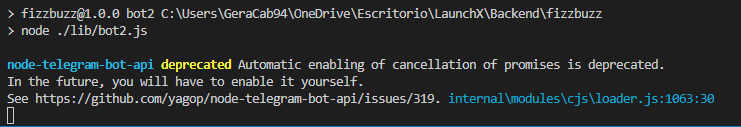
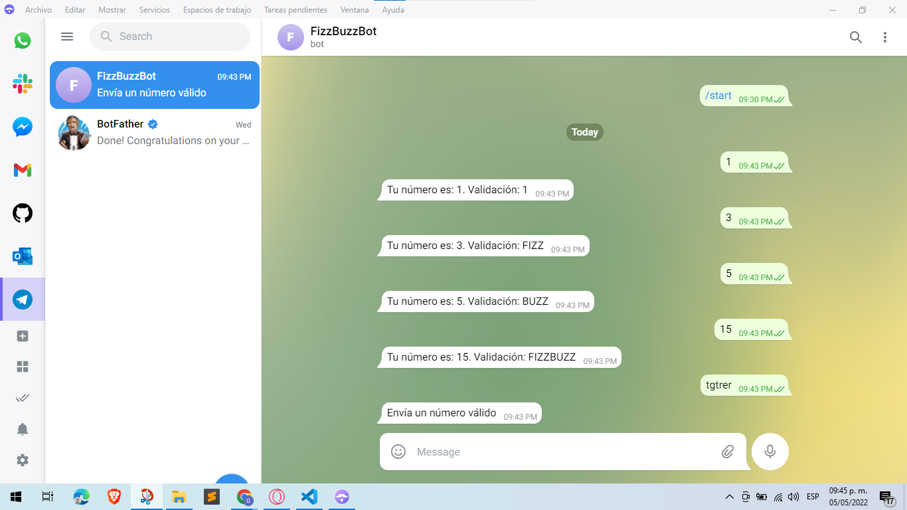
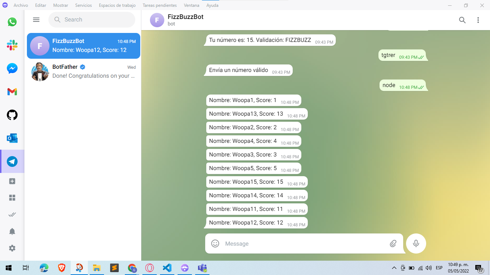
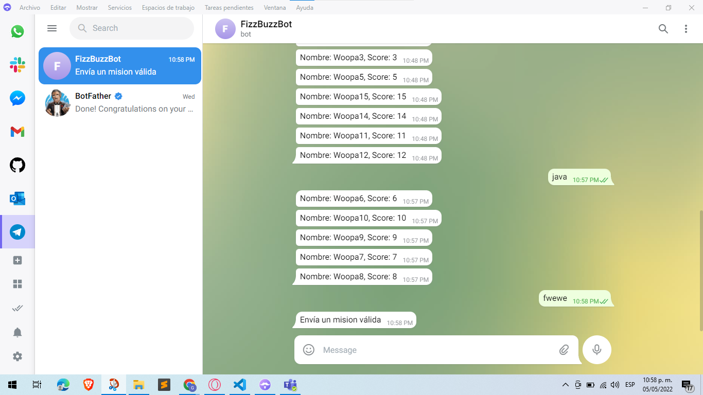

# Practica de la semana 3

## Fizzbuzz

Consiste en un ejercicio basado en una aplicación existente y lo que se tenia que hacer es refactorizar el código.
Tambien tengo el ejercicio forkeado con el pull request [Fizzbuzz](https://github.com/GerardoCabreraH/fizzbuzz-gerardo)

## Nueva configuración 

Se refactorizó la conexión a Express mediante la creación del archivo `lib/config/Express.js`
```
const express = require("express");

class ExpressConfig {
    static startExpress() {
        const app = express();
        return app.use(express.json());
    }
}

module.exports = ExpressConfig;
```

## Paquetes instalados

1. JEST
2. Linter
3. Express
4. Supertest

## Semana 05: Conectar al bot de Telegram

Dependencias instalada

1. Node Telegram Node API
2. DotEnv

## Configurar Bot Telegram

Se creó un archivo para la configuración del bot de Telegram `lib/utils/Telegram.js`

```
require("dotenv").config();

const TelegramBot = require("node-telegram-bot-api");

class TelegramConfig {
    static configBot() {
        const token = process.env.TELEGRAM_BOT_TOKEN;
        return new TelegramBot(token, { polling: true });
    }
}

module.exports = TelegramConfig;

```

## Usar función `getValidationInScore(score)` del controlador `ExplorerController`

Pasos a seguir

01.- Instalar dependencia de NodeJS Telegram `npm install node-telegram-bot-api --save`



02.- Instalar dependencia Dotenv `npm install dotenv --save`



03.- Crear dos archivos de variables de entorno con los nombres `.env` ese no se sube al repositorio y `.env.example` y ahi se pone el token del bot de Telegram

```
TELEGRAM_BOT_TOKEN=""
```

04.- Crear un nuevo script dentro de la carpeta `lib` con el nombre `bot.js` 

Codigo
```
const ExplorerController = require("./controllers/ExplorerController");
const TelegramConfig = require("./utils/Telegram");

const bot = TelegramConfig.configBot();

bot.onText(/\/echo (.+)/, (msg, match) => {
    const chatId = msg.chat.id;
    const resp = match[1];

    bot.sendMessage(chatId, resp);
});

bot.on("message", (msg) => {
    const chatId = msg.chat.id;
    const numberToApplyFb = parseInt(msg.text);

    if(!isNaN(numberToApplyFb)){
        const fizzbuzzTrick = ExplorerController.getValidationInScore(numberToApplyFb);
        const responseBot = `Tu número es: ${numberToApplyFb}. Validación: ${fizzbuzzTrick}`;
        bot.sendMessage(chatId, responseBot);
    } else {
        bot.sendMessage(chatId, "Envía un número válido");
    }
});

bot.on("message", (msg) => {
    const chatId = msg.chat.id;
    const mission = msg.text;
    if(mission === "node"){    
        const explorers = ExplorerController.getExplorersByMission(mission);
        explorers.map((explorer) => {
            bot.sendMessage(chatId, explorer.name);
        });

    }if(mission === "java"){    
        const explorers = ExplorerController.getExplorersByMission(mission);
        explorers.map((explorer) => {
            bot.sendMessage(chatId, explorer.name);
        });

    }else{
        bot.sendMessage(chatId, "Envía un Mision válido");
    }
});
```

05.- Añadir comando para correr el bot en `package.json` y correrlo
```
"bot": "node ./lib/bot.js",
```



## Usar función `getExplorersByMission` del controlador `ExplorerController`

01.- Crear archivo `bot2.js` dentro de la carpeta `lib`
```
const ExplorerController = require("./controllers/ExplorerController");
const TelegramConfig = require("./utils/Telegram")

const bot = TelegramConfig.configBot();

bot.onText(/\/echo (.+)/, (msg, match) => {
    const chatId = msg.chat.id;
    const resp = match[1];

    bot.sendMessage(chatId, resp);
});

bot.on("message", (msg) => {
    const chatId = msg.chat.id;
    const mission = msg.text;
    if(mission === "node"){    
        const explorers = ExplorerController.getExplorersByMission(mission);
        const list = explorers.map((explorer) => {
            `Nombre: ${explorer.name}, Score: ${explorer.score}`;
        });
        bot.sendMessage(chatId, list);
    } else if(mission === "java"){    
        const explorers = ExplorerController.getExplorersByMission(mission);
        const list = explorers.map((explorer) => {
            `Nombre: ${explorer.name}, Score: ${explorer.score}`;
        });
        bot.sendMessage(chatId, list);
    } else{
        bot.sendMessage(chatId, "Envía un mision válida");
    }
});
```

02.- Añadir comando para correr el bot en `package.json` y correrlo
```
"bot2": "node ./lib/bot2.js",
```



## Resultados

Primer bot



Segundo bot






## Datos
- Gerardo Cabrera
- Github: [GerardoCabreraH](https://github.com/GerardoCabreraH)
- Playbook donde se encuentra el ejercicio: [Playbook](https://github.com/GerardoCabreraH/playbook)
