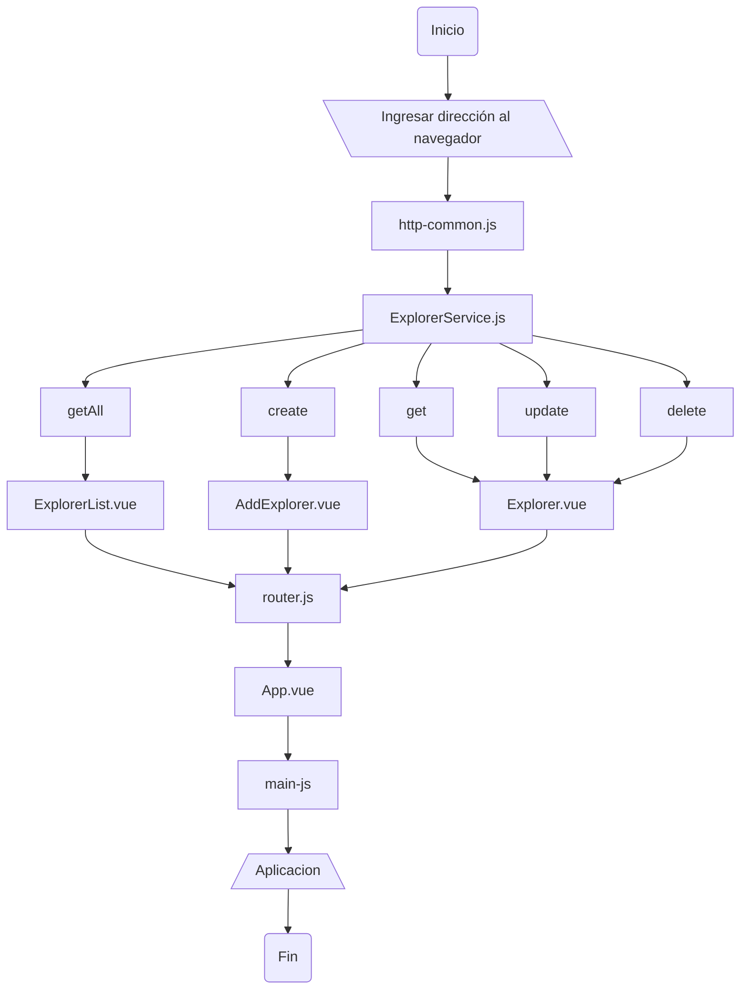
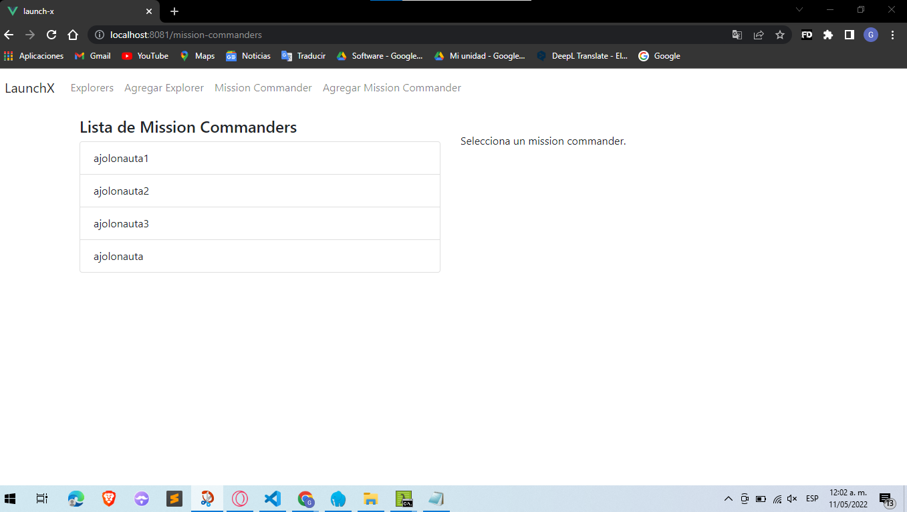
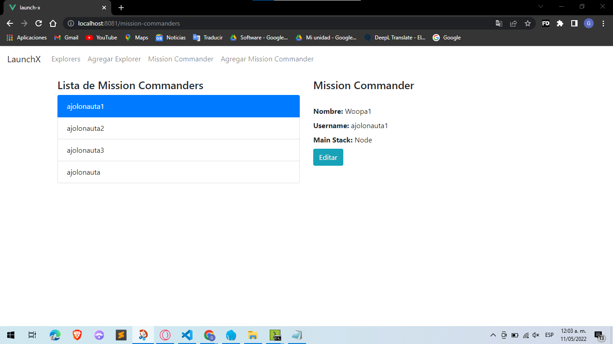
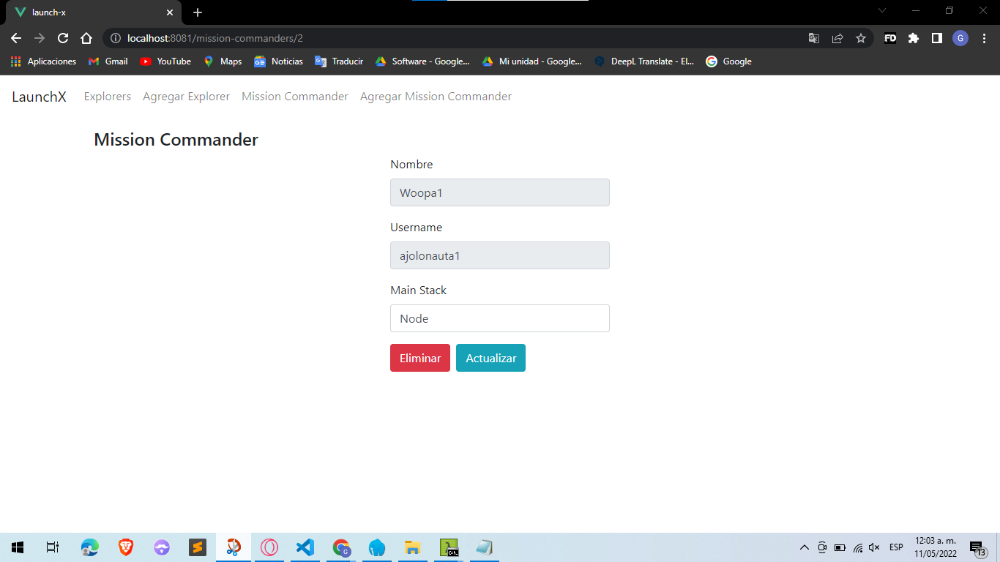

# Documentacion

Proceso del flujo de la aplicación

## Algoritmo

1. Entrar a la pagina web en el navegador
    - Entrar a la pagina de ver todos los datos: `http://localhost:8081/explorers`
    - Entrar a la pagina de crear un dato datos: `http://localhost:8081/add`
    - Entrar a la pagina editar un dato: `http://localhost:8081/explorer/:id`
2. Usar ruta backend mediante `http-common.js` con el paquete axios 
    - Ruta de backend: `http://localhost:3000`
    - Headers: `"Content-type": "application/json"`
3. Traspasar diferentes rutas al archivo `service/ExplorerService` importando el archivo `http-common.js`
    - Ver todos los datos: `getAll()`
    - Crear un dato: `create(data)`
    - Ver un dato: `get(id)`
    - Editar un dato: `update(id, data)`
    - Eliminar un dato: `delete(id)`
4. Se envia la informacion del `ExplorerService` a los componentes
    - Vista `AddExplorer.vue` con la funcion `create(data)`
    - Vista `Explorer.vue` con las funciones `get(id)`, `update(id, data)` y `delete(id)`
    - Vista `ExplorerList.vue` con la funcion `getAll()`
5. Se crea la ruta y se complementan junto con los components mediante el archivo `router.js`
    - Path: `/`, Alias: `/explorers`, Name: `explorers`, Components: `ExplorerList.vue`
    - Path: `/explorer/:id`, Name: `add-explorers`, Components: `AddExplorer.vue`
    - Path: `/add`, Name: `add-explorers`, Components: `AddExplorer.vue`
6. La información de las rutas va al archivo `App.vue` que servira como vista al navegador
7. Al final el funcionamiento de la aplicacion se envia al archivo `main.js`

## Diagrama de flujo



## CRUD Mission Commander

Rutas CRUD `services/ExplorerService.js`
```
getAllMissionCommander() {
    return http.get("/mission-commanders");
}
getMissionCommander(id) {
     http.get(`/mission-commanders/${id}`);
}
createMissionCommander(data) {
    return http.post("/mission-commanders", data);
}
updateMissionCommander(id, data) {
    return http.put(`/mission-commanders/${id}`, data);
}
deleteMissionCommander(id) {
    return http.delete(`/mission-commanders/${id}`);
}
```

## Componentes

`AddMissionCommander.vue`
```
<template>
  <div class="submit-form">
    <div v-if="!submitted">
    <h3>Nuevo Mission Commander</h3>
      <div class="form-group">
        <label for="name">Nombre </label>
        <input
          type="text"
          class="form-control"
          id="name"
          required
          v-model="missionCommander.name"
          name="name"
        />
      </div>
      <div class="form-group">
        <label for="username">Username</label>
        <input
          type="text"
          class="form-control"
          id="username"
          required
          v-model="missionCommander.username"
          name="username"
        />
      </div>
      <div class="form-group">
        <label for="mainStack">Misión Stack</label>
        <input
          type="text"
          class="form-control"
          id="mainStack"
          required
          v-model="missionCommander.mainStack"
          name="mainStack"
        />
      </div>
      <button @click="saveMissionCommander" class="btn btn-success">Agregar</button>
    </div>
    <div v-else>
      <h4> Mission Commander creado exitosamente. </h4>
      <button class="btn btn-success" @click="newMissionCommander">Add</button>
    </div>
  </div>
</template>

<script>
import ExplorerService from "../services/ExplorerService";
export default {
  name: "add-mission-commander",
  data() {
    return {
      missionCommander: {
        id: null,
        name: "",
        username: "",
        mainStack: ""
      },
      submitted: false
    };
  },
  methods: {
    saveMissionCommander() {
      var data = {
        name: this.missionCommander.name,
        username: this.missionCommander.username,
        mainStack: this.missionCommander.mainStack
      };
      ExplorerService.createMissionCommander(data)
        .then(response => {
          this.missionCommander.id = response.data.id;
          this.submitted = true;
        })
        .catch(e => {
          console.log(e);
        });
    },
    newMissionCommander() {
      this.submitted = false;
      this.missionCommander = {};
    }
  }
};
</script>
```

`MissionCommander.vue` 
```
<template>
<h4>Mission Commander</h4>
  <div v-if="currentMissionCommander" class="edit-form">
    <form>
      <div class="form-group">
        <label for="name">Nombre</label>
        <input type="text" disabled class="form-control" id="name"
          v-model="currentMissionCommander.name"
        />
      </div>
      <div class="form-group">
        <label for="username">Username</label>
        <input type="text" disabled class="form-control" id="username"
          v-model="currentMissionCommander.username"
        />
      </div>
      <div class="form-group">
        <label for="mainStack">Main Stack</label>
        <input type="text" class="form-control" id="mainStack"
          v-model="currentMissionCommander.mainStack"
        />
      </div>
    </form>
    <button class="btn btn-danger mr-2" @click="deleteOneMissionCommander">
      Eliminar
    </button>
    <button type="submit" class="btn btn-info mr-2" @click="updateOneMissionCommander">
      Actualizar
    </button>
    <p>{{ message }}</p>
  </div>
  <div v-else>
    <br />
    <p> Selecciona un mission commander. </p>
  </div>
</template>
<script>
import ExplorerService from "../services/ExplorerService";
export default {
  name: "mission-commanders",
  data() {
    return {
      currentMissionCommander: null,
      message: ''
    };
  },
  methods: {
    getOneMissionCommander(id) {
      ExplorerService.getMissionCommander(id)
        .then(response => {
          this.currentMissionCommander= response.data;
        })
        .catch(e => {
          console.log(e);
        });
    },
    deleteOneMissionCommander() {
      ExplorerService.deleteMissionCommander(this.currentMissionCommander.id)
      .then(response => {
        console.log(response.data);
        this.$router.push({ name: "mission-commanders" });
      })
      .catch(e => {
          console.log(e);
      });
    },
    updateOneMissionCommander() {
      ExplorerService.updateMissionCommander(this.currentMissionCommander.id, this.currentMissionCommander)
        .then(response => {
          console.log(response.data);
          this.message = 'Se actualizó correctamente';
        })
        .catch(e => {
          console.log(e);
        });
    }
  },
  mounted() {
    this.message = '';
    this.getOneMissionCommander(this.$route.params.id);
  }
};
</script>

<style>
.edit-form {
  max-width: 300px;
  margin: auto;
}
</style>
```

`MissionCommanderList.vue`
```
<template>
  <div class="list row">
    <div class="col-md-6">
      <h4> Mission Commanders Inscritos </h4>
      <ul class="list-group">
        <li class="list-group-item"
          :class="{ active: index == currentIndex }"
          v-for="(missionCommander, index) in missionCommander"
          :key="index"
          @click="setActiveMissionCommander(missionCommander, index)"
        >
          {{ missionCommander.username }}
        </li>

      </ul>
    </div>
    <div class="col-md-6">
      <div v-if="currentMissionCommander">
        <h4>Mission Commander</h4>
        <div>
          <br><label><strong>Nombre:</strong></label> {{ currentMissionCommander.name}}
          <br><label><strong>Username:</strong></label> {{ currentMissionCommander.username}}
          <br><label><strong>Main Stack:</strong></label> {{ currentMissionCommander.mainStack}}
        </div>
        <router-link :to="'/mission-commanders/' + currentMissionCommander.id" class="btn btn-info"> Editar</router-link>
      </div>
      <div v-else>
        <br />
        <p> Selecciona un mission commander.</p>
      </div>
    </div>
  </div>
</template>
<script>

import ExplorerService from "../services/ExplorerService";

export default {
  name: "mission-commander-list",
  data() {
    return {
      tutorials: [],
      missionCommander: [],
      currentTutorial: null,
      currentMissionCommander: null,
      currentIndex: -1,
      title: "",
      missionCommanderId: ""
    };
  },
  methods: {
    getAllMissionCommanders(){
      ExplorerService.getAllMissionCommander()
        .then(response => {
          this.missionCommander = response.data;
        })
        .catch(e => {
          console.log(e);
        });
    },
    setActiveMissionCommander(missionCommander, index) {
      this.currentMissionCommander= missionCommander;
      this.currentIndex = missionCommander? index : -1;
    }
  },
  mounted() {
    this.getAllMissionCommanders();
  }
};
</script>
```

## Rutas

`router.js`
```
{
    path: "/mission-commanders",
    name: "mission-commanders",
    component: () => import("./components/MissionCommanderList")
  },
  {
    path: "/mission-commanders/:id",
    name: "mission-commander-details",
    component: () => import("./components/MissionCommander")
  },
  {
    path: "/add-mission-commander",
    name: "add-mission-commander",
    component: () => import("./components/AddMissionCommander")
  }
```

## Barra navegadora

`App.vue`
```
<li class="nav-item">
    <router-link to="/mission-commanders" class="nav-link">Mission Commander</router-link>
</li>
<li class="nav-item">
    <router-link to="/add-mission-commander" class="nav-link">Agregar Mission Commander</router-link>
</li>
```

## Resultados

Lista de Mission Commanders
`http://localhost:8081/mission-commanders`


Ver Mission Commander
`http://localhost:8081/add-mission-commander`


Editar Mission Commander
`http://localhost:8081/mission-commanders/:id`
